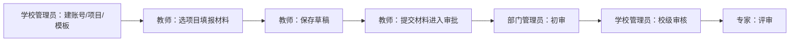

# 教师评选申报材料管理系统 — 操作手册

本文档按**角色**说明可访问的菜单与操作步骤，并用标记说明各**模块 / 功能项**在当前代码中的实现情况（以仓库 `frontend`、`backend` 为准，截至文档编写时）。

**若您是第一次使用，请先阅读下文「从零开始：如何使用本系统」，其中说明环境启动顺序、业务先后顺序、项目发布与材料提交等关键步骤。**

---

## 图例（完成状态）

| 标记 | 含义 |
|------|------|
| **✅** | 已实现：前后端贯通，页面可完成主要操作 |
| **⚠️** | 部分实现：可用但功能简化、占位数据、或仅后端/接口存在 |
| **❌** | 未实现：界面无入口或无法完成闭环 |

---

## 系统角色与菜单可见范围

| 角色 | 说明 | 可访问菜单（侧栏） |
|------|------|-------------------|
| **教师** `teacher` | 填报申报材料 | 首页、我的申报 |
| **部门管理员** `dept_admin` | 部门级审批 | 首页、审批管理 |
| **学校管理员** `school_admin` | 项目/用户/模板与校级事务 | 首页、项目管理、审批管理、模板管理、用户管理 |
| **专家** `expert` | 评审环节审批 | 首页、审批管理 |

未登录用户仅可访问：**登录**、**注册**（自助开户）。

---

## 从零开始：如何使用本系统

### 1. 先把环境跑起来（首次部署）

按仓库 `README.md` 完成：**创建数据库** → 安装后端依赖并配置 `backend/.env`（数据库连接等）→ 启动 `uvicorn` → 安装前端依赖并 `npm run dev`。  
浏览器打开前端地址（默认 `http://localhost:5173`），能打开登录页即表示链路基本通畅。

### 2. 业务上的「先后顺序」（一定要看懂）

本系统是 **「先由学校侧建好项目与用户，教师再填报，再按环节审批」**。典型顺序如下：

说明：

1. **账号**：至少需要一名 **学校管理员** 登录后台，在 **用户管理** 里为教师、部门管理员、专家等创建账号（也可先通过 **注册页** 自助注册，注册时可选择角色；实际生产中建议限制开放注册或仅管理员建号）。
2. **申报项目**：学校管理员在 **项目管理** 中 **新建项目**（名称、时间等）。  
3. **项目必须「已发布」教师才可选**：教师端「新建申报」里的项目列表 **只显示状态为已发布（`status = 1`）的项目**。新建项目默认为 **草稿（`status = 0`）**，教师在下拉里会看不到。学校管理员在 **项目管理** 中可对项目点击 **「发布」**，或在 **「编辑」** 里将状态改为「已发布」。已关闭的项目可 **「重新发布」**。
4. **教师填报**：教师登录 → **我的申报** → **新建申报** → 选择已发布项目 → 填写后 **保存**（草稿）。
5. **提交审批**：材料保存为草稿后，需要 **提交** 才会进入审批队列。当前 **前端申报页没有「提交」按钮**，需开发补全，或暂时在 Swagger 调用 **`POST /api/materials/{material_id}/submit`**（需教师 Token）。提交成功后，材料状态变为「已提交」，**部门管理员** 才能在 **审批管理** 中看到待办。
6. **多级审批**：按角色依次处理 **通过 / 退回 / 驳回**（部门 → 学校 → 专家，与材料当前状态对应；详见下文「材料状态与审批链」）。

### 3. 材料状态与审批链（便于对照列表里的状态）

| 代码 | 含义 | 说明 |
|------|------|------|
| 0 | 草稿 | 教师可编辑、可保存 |
| 1 | 已提交 | 等待部门管理员处理 |
| 2 | 部门已审核 | 等待学校管理员处理 |
| 3 | 学院已审核 | 等待专家处理 |
| 4 | 专家已评审 | 流程结束（通过路径） |
| 5 | 已驳回 | 流程结束（驳回路径） |

各环节 **待办** 由系统自动按材料 **当前状态** 推给对应角色（例如状态为 1 时仅部门管理员待办列表会出现该条）。

### 4. 分角色：最小可 walkthrough

| 角色 | 建议你做的第一件事 | 接下来 |
|------|-------------------|--------|
| **学校管理员** | 登录 → **用户管理** 创建各角色测试账号 → **项目管理** 新建项目 → 按上文 **发布项目** | **模板管理** 按需上传模板；必要时在 **审批管理** 处理校级环节 |
| **教师** | 用教师账号登录 → **我的申报** → **新建申报**（若项目列表为空，先确认已有 **已发布** 项目） | 保存草稿 → **提交**（当前需接口或后续前端按钮） |
| **部门管理员** | 登录 → **审批管理** | 对「已提交」材料执行通过/退回/驳回 |
| **专家** | 登录 → **审批管理** | 在校级通过后的材料上执行评审操作 |

### 5. 常见卡点（排查清单）

| 现象 | 可能原因 |
|------|----------|
| 教师「申报项目」下拉为空 | 项目仍是草稿未发布；或教师角色错误 |
| 部门管理员待办为空 | 教师材料未 **提交**（仍是草稿)；或材料状态已不是本环节 |
| 登录后点菜单被踢回登录页 | Token 失效；或请求路径重定向导致未带 Token（本项目已对列表类 API 使用带 `/` 的路径） |
| 注册/登录失败 | 数据库未启动或 `.env` 配置错误；后端未运行 |

---

## 公共功能（所有角色）

### 登录 / 退出

| 功能项 | 说明 | 状态 |
|--------|------|------|
| 登录 | 用户名 + 密码，成功后进入系统 | ✅ |
| 退出登录 | 右上角用户菜单中退出 | ✅ |
| 注册账号 | `/register`，填写后创建账号并自动登录 | ✅ |

### 首页（仪表盘）

| 功能项 | 说明 | 状态 |
|--------|------|------|
| 欢迎语 | 显示当前用户姓名 | ✅ |
| 统计卡片 | 申报项目数、我的申报、待审批、用户数等 | ⚠️ 数值固定为 0，未接真实统计接口 |

---

## 教师（teacher）

### 我的申报

| 功能项 | 说明 | 状态 |
|--------|------|------|
| 申报列表 | 查看本人申报材料及状态 | ✅ |
| 新建申报 | 选择申报项目，填写表单并保存 | ✅ |
| 编辑申报 | 仅**草稿**（状态 0）可编辑 | ✅ |
| 查看申报 | 已提交等非草稿以「查看」进入（表单仍打开，后端会限制修改） | ⚠️ 体验上未严格区分只读 |
| **提交申报** | 将草稿提交进入审批流 | ⚠️ 后端有 `POST .../submit` 接口，**前端申报页未提供「提交」按钮**，需接口或后续版本补全 |

### 项目管理 / 用户管理 / 模板管理 / 审批管理

教师侧栏**无**上述菜单；若手动输入 URL 访问，可能因权限被拒绝或数据不符合预期。

### 附件上传（材料附件）

| 功能项 | 说明 | 状态 |
|--------|------|------|
| 在申报中上传附件 | 与材料绑定的文件上传 | ❌ 后端有附件接口，**前端申报流程未集成上传界面** |

---

## 部门管理员（dept_admin）

### 审批管理

| 功能项 | 说明 | 状态 |
|--------|------|------|
| 待办列表 | 列出当前角色待处理的材料（按材料状态筛选） | ✅ |
| 通过 / 退回 / 驳回 | 弹窗填写意见后提交 | ✅ |
| 展示材料详情 | 列表中仅材料 ID、状态等，**无详情页** | ⚠️ |

### 首页统计

| 功能项 | 说明 | 状态 |
|--------|------|------|
| 待审批数量等 | 同公共首页，统计为占位 | ⚠️ |

---

## 学校管理员（school_admin）

### 项目管理

| 功能项 | 说明 | 状态 |
|--------|------|------|
| 项目列表 | 查看项目及状态标签 | ✅ |
| 新建项目 | 名称、说明、开始/结束时间 | ✅ |
| 删除项目 | 列表中删除 | ✅ |
| **编辑项目** | 弹窗修改名称、说明、时间、状态 | ✅ |
| **项目状态流转** | 行内 **发布**（草稿→已发布）、**关闭**（已发布→已关闭）、**重新发布**（已关闭→已发布）；编辑弹窗内也可改状态 | ✅ |

### 用户管理

| 功能项 | 说明 | 状态 |
|--------|------|------|
| 用户列表 | 查看用户 | ✅ |
| 新建用户 | 弹窗创建（用户名、密码、姓名、角色、可选部门 ID） | ✅ |
| **编辑用户** | 修改姓名、角色等 | ⚠️ 后端有 `PUT /users/{id}`，**前端无编辑界面** |

### 模板管理

| 功能项 | 说明 | 状态 |
|--------|------|------|
| 模板列表 | 文件名、大小 | ✅ |
| 上传模板 | 上传到服务器模板目录 | ✅ |
| 删除模板 | 删除指定模板文件 | ✅ |

### 审批管理

与部门管理员、专家类似：处理**当前角色对应环节**的待办（校级在流程中为其中一环）。功能项同「部门管理员 — 审批管理」。

| 功能项 | 说明 | 状态 |
|--------|------|------|
| 待办与通过/退回/驳回 | 同上文 | ✅ |
| 材料详情 | 无专门详情页 | ⚠️ |

---

## 专家（expert）

### 审批管理

| 功能项 | 说明 | 状态 |
|--------|------|------|
| 待办列表 | 专家环节待评审材料 | ✅ |
| 通过 / 退回 / 驳回 | 与流程设计一致 | ✅ |

专家**无**项目管理、用户管理、模板管理、我的申报菜单。

---

## 按模块汇总（跨角色）

| 模块 | 主要能力 | 总体状态 |
|------|----------|----------|
| 认证 | 登录、注册、JWT、`/users/me` | ✅ |
| 用户 | 列表、学校管理员新建；更新接口存在 | ⚠️ 缺前端编辑 |
| 项目 | 列表、新建、编辑、删除、发布/关闭/重新发布 | ✅ |
| 申报 | 列表、新建/保存、编辑草稿；提交与附件 | ⚠️ 提交与附件未在 UI 闭环 |
| 审批 | 待办、通过、退回、驳回 | ✅；详情展示弱 |
| 模板 | 列表、上传、删除 | ✅ |
| 附件（材料文件） | 后端 API | ❌ 未接入前端材料页 |
| 首页统计 | 展示卡片 | ⚠️ 占位数据 |

---

## 使用环境与地址（开发默认值）

| 项目 | 地址 |
|------|------|
| 前端 | `http://localhost:5173` |
| 后端 API 文档 | `http://localhost:8000/docs` |

生产环境请替换为实际域名，并配置 HTTPS 与独立密钥（见后端 `SECRET_KEY`、数据库连接等）。

---

## 修订说明

- 完成状态依据**当前仓库实现**标注；迭代开发后请以代码与接口为准更新本表。
- 业务流程与「从零开始」章节应与 README、数据库及接口变更同步维护。
- 若需将「⚠️ / ❌」项排期落地，建议优先：**申报提交按钮**、**材料附件上传**、**首页真实统计**。
