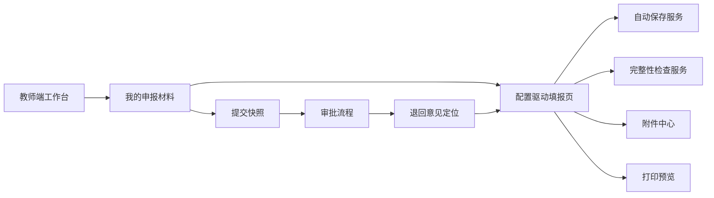

# S2026 教师端能力建设开发设计文档

本文基于 [S2026_教师端使用体验问题与需求建议.md](./S2026_教师端使用体验问题与需求建议.md) 整理，面向后续开发落地。目标是把教师端从“能填报”优化为“清楚知道要做什么、能稳定保存、能快速修改、能预览最终材料”的任务型申报工作台。

## 1. 建设目标

### 1.1 产品目标

- 教师登录后能立即看到可申报项目、待办事项、截止时间和材料状态。
- 教师填写长表单时能自动保存、实时发现错误、清楚看到完成进度。
- 教师能复用个人基本信息、历史申报内容和常用附件，减少重复录入。
- 教师提交前能预览接近最终归档效果的申报表。
- 教师被退回后能按意见清单定位修改，并重新提交。

### 1.2 技术目标

- 复用现有项目、申报配置、材料、审批、附件能力，避免另起一套教师端数据模型。
- 在现有 `ApplyMaterial` 申报材料基础上补齐草稿、校验、快照、附件关联、退回意见定位能力。
- 教师端表单继续使用已发布的申报配置驱动渲染，管理端预览与教师端填报保持同源。
- 自动保存、完整性检查、附件缺失检查、打印预览形成统一提交前检查链路。

## 2. 范围

### 2.1 本期纳入

- 教师端工作台。
- 我的申报状态与待办。
- 申报材料自动保存。
- 申报完整性检查。
- 基本信息复用提示。
- 表格型内容行内录入增强。
- 附件中心与字段级关联。
- 退回意见定位。
- 打印预览入口和预览异常清单。

### 2.2 暂不纳入

- 复杂 PDF 精确分页引擎。
- 企业微信、短信等外部通知真实发送。
- 移动端完整填报体验。
- AI 自动生成申报文本。

以上能力可以预留接口和字段，但不作为第一阶段交付阻塞项。

## 3. 总体架构



核心关系：

- `ApplyProject`：申报项目。
- `ProjectDeclarationConfig`：项目已发布申报配置。
- `ApplyMaterial`：教师在某项目下的一份申报材料。
- `MaterialDraftSnapshot`：自动保存或提交形成的快照。
- `MaterialValidationIssue`：完整性检查结果。
- `MaterialAttachmentLink`：附件与模块、字段、表格行的关联。
- `ApprovalCommentAnchor`：审核意见定位信息。

## 4. 教师端页面设计

### 4.1 教师工作台

路径建议：`/teacher/workbench`。

页面目标：

- 替代教师登录后的普通菜单页。
- 聚合项目、材料、待办、通知、最近保存记录。

页面布局：

| 区域 | 内容 |
| --- | --- |
| 顶部摘要 | 可申报项目数、待提交材料数、退回待修改数、临近截止数 |
| 项目卡片 | 项目名称、状态、截止时间、剩余天数、当前材料状态、主操作按钮 |
| 待办清单 | 待完善基本信息、待补附件、待处理退回意见 |
| 最近记录 | 最近保存时间、最近提交时间、最近预览时间 |
| 帮助入口 | 填报说明、常见问题、项目通知 |

项目卡片按钮规则：

| 材料状态 | 主按钮 |
| --- | --- |
| 未开始 | 开始填报 |
| 草稿 | 继续填报 |
| 已提交 | 查看进度 |
| 已退回 | 去修改 |
| 已通过 | 下载归档 |
| 已截止未提交 | 查看项目 |

### 4.2 申报填报页

路径建议：`/materials/:materialId/edit` 或沿用现有材料填报路由扩展。

页面布局：

- 顶部固定栏：项目名、材料状态、保存状态、预览、完整性检查、提交。
- 左侧目录：模块树、完成状态、错误数量、退回意见数量。
- 中间内容：配置驱动表单。
- 右侧检查清单：必填缺失、附件缺失、格式错误、退回意见。

目录状态：

| 状态 | 展示 |
| --- | --- |
| 未填写 | 灰色圆点 |
| 填写中 | 蓝色圆点 |
| 有错误 | 红色数字 |
| 有警告 | 黄色数字 |
| 已完成 | 绿色勾选 |
| 有退回意见 | 橙色标记 |

### 4.3 附件中心

路径建议：填报页内抽屉或 Tab，后续可独立 `/materials/:materialId/attachments`。

附件按用途分组：

- 必传附件。
- 基本信息附件。
- 模块附件。
- 表格行附件。
- 其他补充材料。

附件卡片字段：

- 附件要求名称。
- 关联位置。
- 是否必传。
- 格式和大小要求。
- 当前文件。
- 上传、替换、删除。
- 最近更新时间。

### 4.4 打印预览页

路径建议：`/materials/:materialId/preview`。

页面结构：

- 左侧页面缩略图。
- 中间 A4 预览。
- 右侧异常清单。
- 顶部操作：返回修改、下载 PDF、确认提交。

第一阶段可以先复用现有 `DeclarationConfigRenderer` 做浏览器预览，异常清单来自完整性检查；第二阶段再实现真实 PDF 渲染和分页异常。

### 4.5 退回修改页

退回后仍进入填报页，但默认打开“退回意见清单”。

能力：

- 按模块分组展示审核意见。
- 点击意见定位到字段、附件或表格行。
- 教师修改后可标记为已处理。
- 重新提交时展示本次处理摘要。

## 5. 状态设计

### 5.1 材料状态

建议扩展或统一材料状态枚举：

| 状态 | 说明 | 教师可编辑 |
| --- | --- | --- |
| not_started | 未开始 | 是 |
| draft | 草稿 | 是 |
| submitted | 已提交 | 否 |
| returned | 已退回 | 是 |
| resubmitted | 已重新提交 | 否 |
| approved | 已通过 | 否 |
| rejected | 未通过 | 否 |
| archived | 已归档 | 否 |

如当前后端已有状态码，应在服务层做映射，前端不要直接依赖散落的数字状态。

### 5.2 保存状态

前端保存状态：

| 状态 | 触发 |
| --- | --- |
| idle | 无未保存变更 |
| dirty | 本地有变更 |
| saving | 正在保存 |
| saved | 已保存到服务器 |
| failed | 保存失败 |
| offline_cached | 保存失败但已缓存到本地 |

保存状态展示在填报页顶部，避免教师不确定内容是否已落库。

### 5.3 提交快照

每次提交生成不可变快照：

- 草稿可以继续覆盖保存。
- 提交快照不可修改。
- 退回后基于最新快照生成新的可编辑草稿。
- 审核意见绑定到某次提交快照和具体位置。
- 归档使用最终通过的提交快照。

## 6. 数据模型设计

### 6.1 material_draft_snapshot

保存自动保存、手动保存、提交时的材料快照。

| 字段 | 类型 | 说明 |
| --- | --- | --- |
| id | bigint | 主键 |
| material_id | bigint | 申报材料 ID |
| snapshot_type | varchar | autosave / manual / submit / return_base |
| version | int | 快照版本 |
| data_json | json | 材料数据 |
| config_version | int | 使用的申报配置版本 |
| created_by | bigint | 创建人 |
| created_at | datetime | 创建时间 |

索引：

- `idx_material_snapshot_material_id`
- `uq_material_snapshot_version(material_id, version)`

### 6.2 material_validation_issue

保存完整性检查结果。

| 字段 | 类型 | 说明 |
| --- | --- | --- |
| id | bigint | 主键 |
| material_id | bigint | 申报材料 ID |
| module_key | varchar | 模块 key |
| section_key | varchar | 内容块 key |
| field_key | varchar | 字段 key，可空 |
| row_key | varchar | 表格行 key，可空 |
| attachment_key | varchar | 附件 key，可空 |
| level | varchar | error / warning |
| issue_type | varchar | required / format / attachment / print / returned |
| message | varchar | 提示文案 |
| resolved | bool | 是否已处理 |
| created_at | datetime | 创建时间 |
| updated_at | datetime | 更新时间 |

### 6.3 material_attachment_link

附件与材料内容位置的关联。

| 字段 | 类型 | 说明 |
| --- | --- | --- |
| id | bigint | 主键 |
| material_id | bigint | 申报材料 ID |
| attachment_id | bigint | 文件附件 ID |
| module_key | varchar | 模块 key |
| section_key | varchar | 内容块 key |
| field_key | varchar | 字段 key，可空 |
| row_key | varchar | 表格行 key，可空 |
| attachment_key | varchar | 附件配置 key |
| required | bool | 是否必传 |
| created_at | datetime | 创建时间 |

### 6.4 approval_comment_anchor

审核意见定位信息。

| 字段 | 类型 | 说明 |
| --- | --- | --- |
| id | bigint | 主键 |
| approve_record_id | bigint | 审核记录 ID |
| material_id | bigint | 申报材料 ID |
| module_key | varchar | 模块 key |
| section_key | varchar | 内容块 key |
| field_key | varchar | 字段 key，可空 |
| row_key | varchar | 表格行 key，可空 |
| attachment_key | varchar | 附件 key，可空 |
| comment | text | 审核意见 |
| resolved | bool | 教师是否标记处理 |
| created_at | datetime | 创建时间 |
| updated_at | datetime | 更新时间 |

### 6.5 notification_message

站内通知消息。

| 字段 | 类型 | 说明 |
| --- | --- | --- |
| id | bigint | 主键 |
| user_id | bigint | 接收人 |
| type | varchar | project_open / deadline / returned / approved |
| title | varchar | 标题 |
| content | text | 内容 |
| target_url | varchar | 跳转地址 |
| read_at | datetime | 已读时间 |
| created_at | datetime | 创建时间 |

## 7. 接口设计

### 7.1 教师工作台

`GET /api/teacher/workbench`

返回：

```json
{
  "summary": {
    "availableProjects": 2,
    "draftMaterials": 1,
    "returnedMaterials": 1,
    "deadlineSoon": 1
  },
  "projects": [
    {
      "projectId": 1,
      "projectName": "2026 年度人才申报",
      "deadline": "2026-06-30T23:59:59",
      "daysLeft": 49,
      "projectStatus": "open",
      "materialId": 12,
      "materialStatus": "draft",
      "completion": 68,
      "errorCount": 3,
      "warningCount": 2,
      "lastSavedAt": "2026-05-12T10:20:00"
    }
  ],
  "todos": [],
  "notifications": []
}
```

### 7.2 获取材料填报上下文

`GET /api/materials/{material_id}/edit-context`

返回：

- 项目信息。
- 材料状态。
- 已发布申报配置。
- 当前草稿数据。
- 附件关联列表。
- 校验问题。
- 退回意见定位列表。

### 7.3 自动保存材料

`PUT /api/materials/{material_id}/draft`

请求：

```json
{
  "data": {},
  "clientRevision": "uuid-or-number",
  "saveType": "autosave"
}
```

返回：

```json
{
  "materialId": 12,
  "serverRevision": 18,
  "savedAt": "2026-05-12T10:20:00"
}
```

冲突规则：

- 前端提交 `clientRevision`。
- 后端发现客户端版本落后时返回 `409`。
- 前端提示“服务器已有更新”，允许刷新或另存本地副本。

### 7.4 完整性检查

`POST /api/materials/{material_id}/validate`

请求：

```json
{
  "data": {},
  "scope": "all"
}
```

返回：

```json
{
  "valid": false,
  "completion": 82,
  "errors": [
    {
      "moduleKey": "basic",
      "sectionKey": "profile",
      "fieldKey": "mobile",
      "level": "error",
      "issueType": "required",
      "message": "手机号码不能为空"
    }
  ],
  "warnings": []
}
```

### 7.5 提交材料

`POST /api/materials/{material_id}/submit`

流程：

1. 保存当前草稿。
2. 执行完整性检查。
3. 有 error 则拒绝提交。
4. 生成 submit 快照。
5. 状态更新为 submitted 或 resubmitted。
6. 创建审批流实例或进入下一审批节点。

### 7.6 附件关联

`POST /api/materials/{material_id}/attachment-links`

请求：

```json
{
  "attachmentId": 1001,
  "moduleKey": "achievement",
  "sectionKey": "awards",
  "rowKey": "row_001",
  "attachmentKey": "proof_file"
}
```

`DELETE /api/materials/{material_id}/attachment-links/{link_id}`

### 7.7 退回意见定位

`GET /api/materials/{material_id}/return-comments`

`PUT /api/materials/{material_id}/return-comments/{comment_id}/resolved`

请求：

```json
{
  "resolved": true
}
```

### 7.8 打印预览

`GET /api/materials/{material_id}/print-preview`

第一阶段返回前端渲染所需数据：

- 配置。
- 材料数据。
- 校验问题。

第二阶段可扩展：

- `GET /api/materials/{material_id}/print-preview/pdf`
- `POST /api/materials/{material_id}/print-preview/render`

## 8. 前端模块拆分

建议目录：

```text
frontend/src/pages/teacher/
  TeacherWorkbench.tsx
  TeacherWorkbench.css

frontend/src/pages/materials/
  MaterialEditPage.tsx
  MaterialPrintPreviewPage.tsx
  MaterialAttachmentCenter.tsx
  MaterialReturnCommentsPanel.tsx
  MaterialValidationPanel.tsx

frontend/src/features/material-draft/
  useMaterialDraft.ts
  materialValidation.ts
  materialAutosave.ts
  materialProgress.ts

frontend/src/services/
  teacherWorkbench.ts
  materialDraft.ts
  materialValidation.ts
  materialAttachmentLinks.ts
```

### 8.1 useMaterialDraft

职责：

- 管理当前材料数据。
- 监听表单变化。
- 防抖自动保存。
- 维护保存状态。
- 本地缓存保存失败内容。
- 暴露 `saveNow`、`submit`、`validate`。

建议行为：

- 输入停止 1200ms 后自动保存。
- 切换模块前若有未保存内容，立即保存。
- 页面关闭前如有未保存内容，弹出浏览器确认。
- 保存失败时写入 `localStorage` 或 `indexedDB`。

### 8.2 materialValidation

职责：

- 根据申报配置和材料数据计算必填、格式、附件缺失。
- 将校验结果转换为目录状态和右侧检查清单。
- 支持点击定位。

### 8.3 materialProgress

完成度计算：

```text
完成度 = 已完成必填项数量 / 全部必填项数量
```

补充规则：

- 必传附件计入必填项。
- 表格最小行数计入必填项。
- 有 error 的模块不能显示为已完成。

## 9. 配置扩展建议

为了支持教师端体验，需要在申报配置中补充部分字段。

### 9.1 字段级帮助

```json
{
  "name": "workSummary",
  "label": "主要工作业绩简介",
  "type": "textarea",
  "required": true,
  "helpText": "请填写近 5 年代表性业绩。",
  "placeholder": "可按项目、奖项、论文、转化成果分别描述。",
  "maxLength": 300
}
```

### 9.2 附件要求

```json
{
  "attachments": [
    {
      "key": "award_proof",
      "label": "获奖证明",
      "required": true,
      "accept": ".pdf,.jpg,.png",
      "maxSizeMb": 10,
      "scope": "row"
    }
  ]
}
```

### 9.3 表格粘贴配置

```json
{
  "pasteEnabled": true,
  "importEnabled": true,
  "rowKeyField": "id",
  "minRows": 1,
  "maxRows": 10
}
```

### 9.4 打印预览定位

```json
{
  "printAnchor": {
    "moduleKey": "work",
    "sectionKey": "workExperience",
    "fieldKey": "company"
  }
}
```

## 10. 后端服务设计

### 10.1 MaterialDraftService

职责：

- 获取材料编辑上下文。
- 保存草稿。
- 生成快照。
- 处理保存冲突。
- 提交材料。

### 10.2 MaterialValidationService

职责：

- 从项目已发布配置读取字段和附件要求。
- 校验材料数据。
- 生成 `MaterialValidationIssue`。
- 计算完成度。

校验类型：

- 必填字段。
- 字段格式。
- 字数限制。
- 日期范围。
- 表格行数。
- 附件必传。
- 打印布局可预见异常。

### 10.3 MaterialAttachmentService

职责：

- 维护附件和业务位置关系。
- 检查附件格式、大小、必传。
- 支持常用附件复制到当前材料。

### 10.4 MaterialPrintService

职责：

- 汇总配置、材料数据、附件信息。
- 生成预览数据。
- 后续生成 PDF。
- 记录打印预览快照。

### 10.5 TeacherWorkbenchService

职责：

- 聚合教师可申报项目。
- 聚合材料状态和截止时间。
- 聚合待办、通知、最近保存记录。

## 11. 实施计划

### 11.1 第一阶段：教师端主路径可控

目标：教师知道要填什么、能自动保存、提交前能看到错误。

开发内容：

- 教师工作台。
- 材料编辑上下文接口。
- 自动保存 Hook 和草稿保存接口。
- 完整性检查接口。
- 填报页目录完成状态。
- 提交前检查弹窗。

验收：

- 教师能从工作台进入项目继续填报。
- 长表单修改后能自动保存。
- 必填缺失不能提交。
- 校验问题能定位到对应模块。

### 11.2 第二阶段：提升填写效率

目标：减少重复录入和附件混乱。

开发内容：

- 基本信息复用提示。
- 表格行内编辑增强。
- 复制行、拖拽排序、Excel 粘贴。
- 附件中心。
- 附件字段级、行级关联。

验收：

- 教师能复制表格行。
- 教师能把附件关联到某条成果。
- 附件缺失能在检查清单中展示。
- 常用基本信息自动带入。

### 11.3 第三阶段：退回修改和打印预览

目标：减少退回后的沟通成本，提交前看到最终效果。

开发内容：

- 审核意见定位。
- 退回意见清单。
- 重新提交修改摘要。
- 打印预览页。
- 预览异常清单。

验收：

- 退回意见能点击定位。
- 教师能标记意见已处理。
- 重新提交生成新快照。
- 预览页能显示完整申报表。

### 11.4 第四阶段：通知和移动端轻量体验

目标：降低错过节点风险。

开发内容：

- 站内通知。
- 截止提醒任务。
- 移动端工作台适配。
- 移动端附件上传优化。

验收：

- 项目临近截止能产生提醒。
- 退回修改能产生通知。
- 手机端能查看状态和上传附件。

## 12. 风险与处理

| 风险 | 说明 | 处理 |
| --- | --- | --- |
| 自动保存频繁请求 | 长表单输入可能触发大量保存 | 防抖、合并保存、模块级保存 |
| 草稿冲突 | 多端同时打开材料 | clientRevision + 409 冲突提示 |
| 校验规则分散 | 前后端各写一套容易不一致 | 后端作为最终校验，前端做即时提示 |
| 附件与字段关系复杂 | 行级附件定位容易丢失 | 为表格行生成稳定 rowKey |
| 打印预览和 PDF 不一致 | 浏览器预览不等于最终 PDF | 第一阶段标记为页面预览，第二阶段统一 PDF 服务 |
| 配置变更影响草稿 | 管理端发布新版本后教师草稿结构变化 | 材料绑定 configVersion，已开始材料继续使用原版本 |

## 13. 验收指标

| 指标 | 目标 |
| --- | --- |
| 首次提交成功率 | 提升 |
| 必填缺失退回数量 | 降低 |
| 附件缺失退回数量 | 降低 |
| 平均填报耗时 | 降低 |
| 自动保存失败率 | 可观测并逐步降低 |
| 退回后平均修改耗时 | 降低 |
| 截止前未提交人数 | 降低 |
| 教师咨询工单数量 | 降低 |

## 14. 开发顺序建议

建议优先顺序：

1. 梳理当前 `ApplyMaterial` 状态和数据结构，确定与新状态的映射。
2. 增加教师工作台聚合接口和页面。
3. 抽出材料编辑上下文接口。
4. 实现自动保存和保存状态。
5. 实现完整性检查和目录状态。
6. 实现提交前检查。
7. 增强表格录入。
8. 建设附件中心。
9. 接入退回意见定位。
10. 建设打印预览页。

## 15. 与现有能力的关系

| 现有能力 | 本设计处理方式 |
| --- | --- |
| 项目管理 | 复用项目开放状态、截止时间、项目配置 |
| 申报配置 | 继续作为教师端渲染来源 |
| 基本信息主数据 | 作为教师端基本信息复用来源 |
| 材料填报 | 在现有材料数据上补齐草稿、校验、快照 |
| 附件上传 | 增加业务位置关联，不替换底层文件上传 |
| 审批流程 | 退回意见增加定位信息，流程本身复用 |
| 配置预览 | 教师打印预览复用渲染组件，后续扩展 PDF |

## 16. 结论

教师端能力建设应先解决“看得懂、存得住、交得上”的核心问题，再解决“填得快、改得准、打得好”。第一阶段优先交付工作台、自动保存、完整性检查和提交前校验，可以最快降低教师焦虑和管理员沟通成本；第二阶段之后再持续增强表格录入、附件中心、退回定位和打印预览，形成完整的教师端申报体验闭环。
