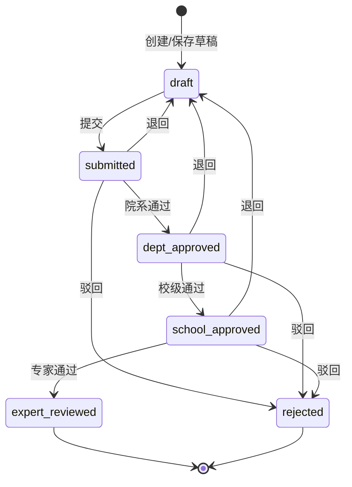

# 申报审批流程设计

本文描述**申报材料**从提交到终审的审批状态机、角色与环节对应关系、审批留痕、教师端进度查看与审核人通知策略。实现以当前后端模型与接口为准，并与 [user-permission-design.md](./user-permission-design.md) 中的权限、数据范围原则一致。

**版本**：V1.0  
**日期**：2026-04  

---

## 1. 目标与范围

| 维度 | 说明 |
|------|------|
| 范围 | 单条 `ApplyMaterial`（用户在某项目下的一份申报实例）上的多级审批 |
| 不包含 | 申报表单结构（见 [project-declaration-config-design.md](./project-declaration-config-design.md)）；通用权限元数据定义（见 user-permission-design） |
| 原则 | **状态机**表达环节；**功能权限**控制能否进入审批能力；**数据范围**控制列表与单条是否可见；**审批记录**用于审计与教师端展示 |

---

## 2. 状态定义

材料表 `apply_material.status` 使用整型编码，与实现注释一致：

| 值 | 含义 | 说明 |
|----|------|------|
| 0 | `draft` | 草稿，可编辑 |
| 1 | `submitted` | 已提交，待下一环节处理（首环节为院系） |
| 2 | `dept_approved` | 院系审批通过，待校级 |
| 3 | `school_approved` | 校级审批通过，待专家 |
| 4 | `expert_reviewed` | 专家评审完成（当前线性流程终点） |
| 5 | `rejected` | 驳回，流程结束 |

退回修改：将状态置回 `0`（草稿），申报人需修改后再次提交。

### 2.1 项目级审批人配置（`apply_project.approval_flow`）

| 项 | 说明 |
|----|------|
| 存储 | JSON，含 `steps` 数组，**固定 3 条**，与材料状态 `1→2→3`（提交后三级审批）一一对应 |
| 每条 | `title`（环节名称）、`assignee_user_id`（该环节唯一审批人） |
| 配置入口 | **项目管理**中新建/编辑项目时填写；可选拉取 `GET /projects/approver-candidates` 选用户 |
| 行为 | **已配置**：待办与「通过/退回/驳回」仅当 `当前用户 id = 该环节 assignee`；**未配置**：沿用本节下文 **按激活角色 + 材料状态** 的 legacy 规则 |
| 展示 | `GET /projects/{id}` 返回 `approval_flow_display`（环节 + 审批人姓名），供教师端「审批中心」预览「谁审」 |

---

## 3. 状态迁移

### 3.1 正常通过（逐级）

审批人执行「通过」时，材料状态从「当前环节对应值」进入「下一环节值」。与**激活角色**（legacy 角色：`dept_admin` / `school_admin` / `expert`）及当前状态对齐后方可操作。

| 角色 | 当前状态须为 | 通过后下一状态 |
|------|----------------|----------------|
| `dept_admin` | 1（submitted） | 2（dept_approved） |
| `school_admin` | 2（dept_approved） | 3（school_approved） |
| `expert` | 3（school_approved） | 4（expert_reviewed） |

### 3.2 退回与驳回

| 操作 | 材料状态变化 | 审批记录中的业务含义 |
|------|----------------|----------------------|
| 退回修改 | → `0`（draft） | 记录为退回，附意见 |
| 驳回 | → `5`（rejected） | 记录为驳回，附意见 |

### 3.3 流程示意（Mermaid）

---

## 4. 审批留痕（ApproveRecord）

表 `approve_record` 记录每次审批动作，用于审计与教师端时间轴。

| 字段语义 | 说明 |
|----------|------|
| `material_id` | 关联材料 |
| `approver_id` | 操作人用户 ID |
| `status`（记录内） | `1` 通过、`2` 退回、`3` 驳回（与材料主状态字段含义不同，勿混淆） |
| `comment` | 审批意见 |
| `created_at` | 操作时间 |

材料主状态仍仅以 `apply_material.status` 为准；历史以 `approve_record` 按时间排序展示。

---

## 5. 权限与待办

- **处理审批**：需要权限点 `declaration:approval:process`（具体以系统权限配置为准），并结合当前激活角色判断能否在对应 `status` 上操作。
- **待办列表**：若项目配置了 `approval_flow`，按「材料当前状态对应环节的 `assignee_user_id`」筛选；否则按「当前角色对应的 required_status」筛选（见 `ROLE_APPROVE_STATUS` 与 `list_pending`）。
- **数据范围**：列表与单条详情须校验申报人、部门、项目等范围，避免仅凭 `material_id` 越权；详细策略见 [user-permission-design.md](./user-permission-design.md) 第 5～6 节。文档原则：**功能权限**决定能否进入审批能力，**数据权限 + 状态**决定条是否出现在待办中。

---

## 6. 教师端：查看审批进度

**目标**：展示「当前卡在哪一环节」以及「历史每一步的操作人、结果、意见、时间」。

**建议数据用法**：

1. 材料详情：读取 `status`、`submitted_at` 等，映射为文案（如：待院系审核、待校级审核、…、已通过、已驳回、草稿待提交）。
2. 轨迹：调用按材料查询审批记录的接口，按 `created_at` 升序展示；可与固定环节（提交 → 院系 → 校级 → 专家 → 结束）用步骤条或时间轴对齐展示。

**安全**：仅允许申报人本人（或具备合规管理权限的角色）查看本人材料的进度与记录；服务端必须校验材料归属或数据范围。

---

## 7. 审核人通知策略

待办列表本身即一种「登录后可见」的工作入口。以下为扩展建议，可按迭代实施。

| 阶段 | 方式 | 说明 |
|------|------|------|
| 基线 | 审批工作台待办 | 审核人登录后进入待办，依赖 `status` + 角色/数据范围筛选 |
| 二期 | 站内消息 / 未读角标 | 在提交或环节推进时写入通知表，关联 `material_id`、接收人、已读状态 |
| 可选 | 邮件 / 企业微信等 | 异步发送；收件人解析依赖用户联系方式及组织维度（如院系管理员只通知本院系待办） |

**建议覆盖的事件**（产品可裁剪）：教师提交；院系/校级/专家通过进入下一环节；退回；驳回。收件人解析应与数据范围一致，避免「静态角色」导致错发或漏发（参见 user-permission-design 中审批与数据范围的关系）。

---

## 8. 演进说明

- **一期**：维持线性多级状态机 + 审批记录即可满足业务与审计。
- **后续**：若需并行会签、加签、条件分支，可引入环节定义或工作流引擎；届时需单独评估与 `apply_material.status` 的映射策略。

---

## 9. 实现对照（代码位置）

| 内容 | 位置 |
|------|------|
| 材料状态 | `backend/app/models/material.py` → `ApplyMaterial.status` |
| 审批记录 | `backend/app/models/approval.py` → `ApproveRecord` |
| 角色与状态迁移、待办、通过/退回/驳回、记录查询 | `backend/app/api/approvals.py` |
| 项目审批流 JSON 解析 | `backend/app/services/approval_flow_service.py` |
| 项目保存审批人、`approver-candidates`、展示字段 | `backend/app/api/projects.py`、`apply_project.approval_flow` |
| 项目管理中配置三环节审批人 | `frontend/src/pages/projects/ProjectList.tsx` |
| 教师端进度（步骤条 + 时间轴，可复用于抽屉） | `frontend/src/pages/materials/MaterialApprovalProgress.tsx` |
| 教师端与审核端统一入口 | `frontend/src/pages/approvals/ApprovalCenterPage.tsx`，路由 `/declaration/approvals`（教师「我的进度」与审核人「待我审批」分 Tab；仅具一种权限时只显示对应区块） |
| 申报编辑/只读/提交 | `frontend/src/pages/materials/MaterialForm.tsx`（不含大段进度区，避免与填报混在一起） |
| 审批中心（待办 + 我的进度） | `frontend/src/pages/approvals/ApprovalCenterPage.tsx` |

---

## 修订记录

| 版本 | 日期 | 说明 |
|------|------|------|
| v1.0 | 2026-04 | 初稿：状态机、角色、留痕、教师进度、通知分期 |
