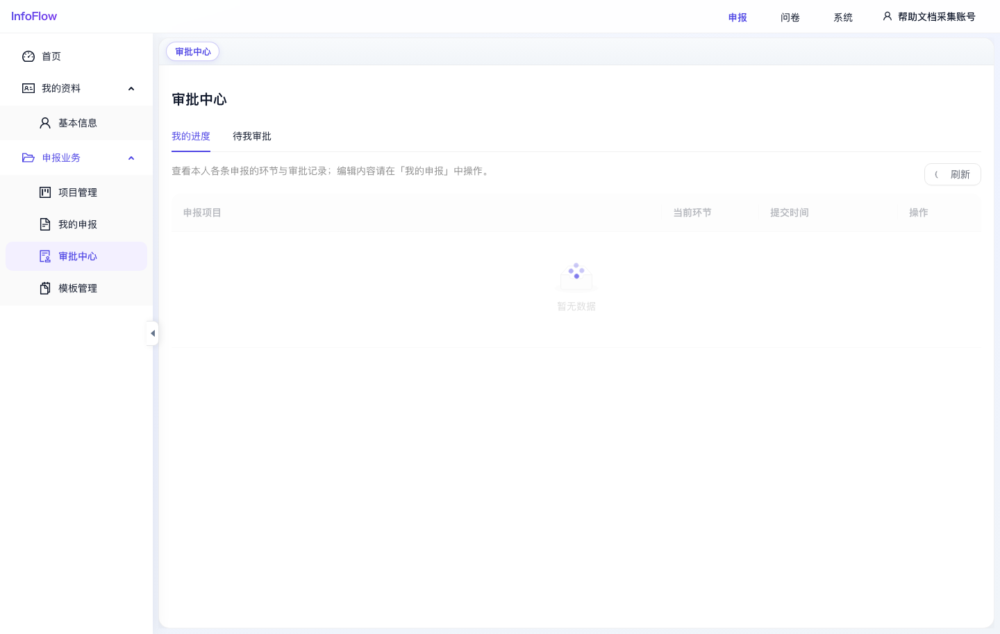

# 审批中心

入口路径：`/declaration/approvals`

## 页面用途

审批中心用于查看申报材料审批状态，并处理需要当前用户审批的任务。

## 页面结构

- “我的进度”：查看本人申报材料所处环节和审批记录。
- “待我审批”：查看需要当前用户处理的审批任务。
- “刷新”：重新加载审批数据。

## 操作步骤

1. 进入“申报 / 申报业务 / 审批中心”。
2. 在“我的进度”查看本人申报项目、当前环节和提交时间。
3. 切换到“待我审批”查看待办审批。
4. 点击对应记录的操作按钮进入审批或查看页面。
5. 需要修改材料内容时，返回“我的申报”处理。

## 注意事项

- 截图采集时“我的进度”暂无数据。
- 文案提示“编辑内容请在「我的申报」中操作”，审批中心主要负责进度查看和审批办理。

## 页面截图

