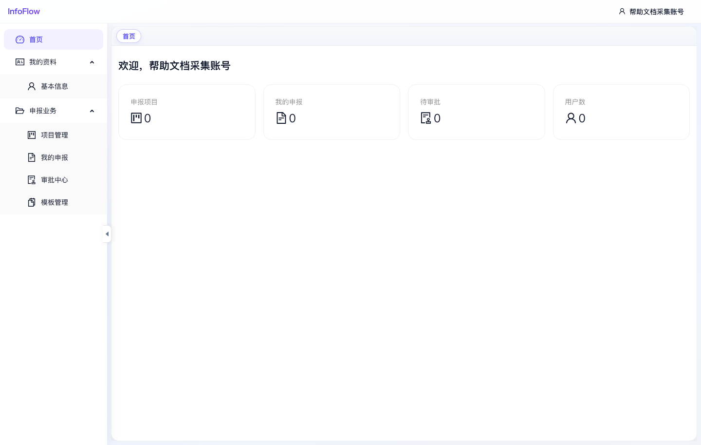

# 申报首页

入口路径：`/declaration/dashboard`

## 页面用途

申报首页是进入申报模块后的默认工作台，用于快速查看当前用户相关的申报业务概览。

## 页面信息

- 顶部显示当前登录用户名称。
- 页面展示四个统计卡片：申报项目、我的申报、待审批、用户数。
- 左侧菜单可进入“我的资料”“项目管理”“我的申报”“审批中心”“模板管理”等页面。

## 操作说明

1. 登录后默认进入申报首页。
2. 查看统计卡片了解当前业务数量。
3. 通过左侧菜单进入具体功能页面。

## 注意事项

- 统计数值取决于当前环境数据和接口实现；截图中采集账号的统计值均为 0。
- 不同角色可见的左侧菜单可能不同。

## 页面截图

