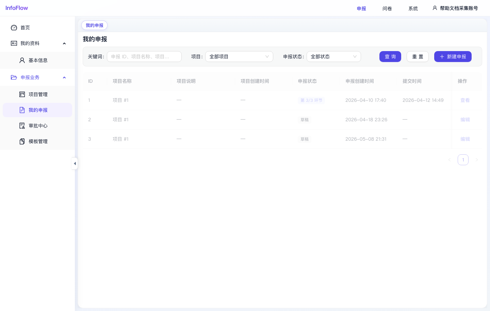

# 我的申报

入口路径：`/declaration/materials`

## 页面用途

我的申报用于申报人查看、创建和编辑自己的申报材料。管理员账号也可根据权限查看对应范围内的申报记录。

## 页面功能

- 按关键词筛选申报材料。
- 按项目筛选，默认可选“全部项目”。
- 按申报状态筛选，默认可选“全部状态”。
- 点击“查询”执行筛选。
- 点击“重置”恢复默认条件。
- 点击“新建申报”创建新的申报材料。
- 列表展示 ID、项目名称、项目说明、项目创建时间、申报状态、申报创建时间、提交时间和操作。

## 常用操作

1. 新建申报：点击“新建申报”，选择项目并填写材料。
2. 编辑草稿：状态为“草稿”的记录可点击“编辑”继续填写。
3. 查看已提交材料：已进入审批流程的记录可点击“查看”查看详情。
4. 跟踪状态：通过“申报状态”列查看材料处于草稿、审批环节或其他状态。

## 注意事项

- 提交后的材料通常不在本页直接修改，需根据审批规则或退回状态决定是否可编辑。
- 审批进度详情可在“审批中心”查看。

## 页面截图

