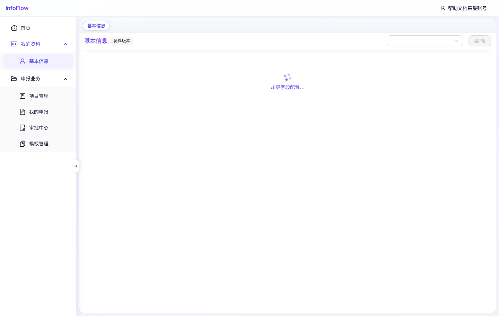

# 我的资料 - 基本信息

入口路径：`/declaration/profile`

## 页面用途

基本信息页面用于维护申报人个人资料。申报材料填报时，系统可从这里读取基础信息并带入申报表单。

## 页面信息

- 页面标题为“基本信息”。
- 页面提供“资料版本”信息区。
- 点击“编辑”可进入资料编辑状态。
- 字段内容由“系统 / 基本信息字段”中的字段目录配置动态生成。

## 操作步骤

1. 进入“申报 / 我的资料 / 基本信息”。
2. 查看当前资料版本和已保存的基础信息。
3. 点击“编辑”更新个人资料。
4. 按页面字段填写或上传证明材料。
5. 保存后，后续申报材料可复用这些资料。

## 注意事项

- 截图采集时页面停留在“加载字段配置…”状态，说明该页面依赖字段配置接口返回后再渲染表单。
- 如果长期停留在加载状态，请检查后端接口、字段目录数据和浏览器控制台错误。

## 页面截图

