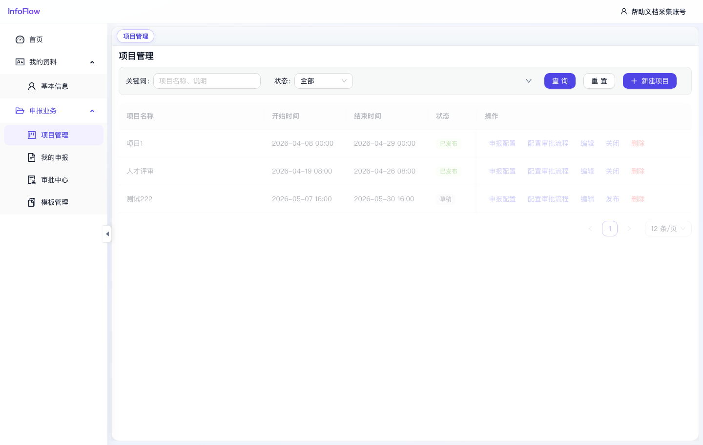

# 项目管理

入口路径：`/declaration/projects`

## 页面用途

项目管理用于维护评选或申报项目。管理员可创建项目、配置申报表单、配置审批流程，并控制项目发布或关闭。

## 页面功能

- 按关键词筛选项目。
- 按状态筛选项目，支持“全部”等选项。
- 点击“查询”执行筛选。
- 点击“重置”清空筛选条件。
- 点击“新建项目”创建新的申报项目。
- 列表展示项目名称、开始时间、结束时间、状态和操作。

## 常用操作

1. 新建项目：点击“新建项目”，填写项目名称、起止时间等信息后保存。
2. 配置申报表：在目标项目行点击“申报配置”，进入该项目的申报表单配置。
3. 配置审批流程：点击“配置审批流程”，维护该项目对应的审批节点和办理人规则。
4. 编辑项目：点击“编辑”修改项目基础信息。
5. 发布项目：草稿项目可点击“发布”，发布后申报人才能按项目要求填报。
6. 关闭项目：已发布项目可点击“关闭”，停止后续申报。
7. 删除项目：点击“删除”移除项目，操作前应确认没有仍需保留的业务数据。

## 注意事项

- 截图中可见项目状态包括“已发布”和“草稿”。
- 与申报配置、审批流程相关的按钮通常只对具备项目管理权限的用户可见。

## 页面截图

