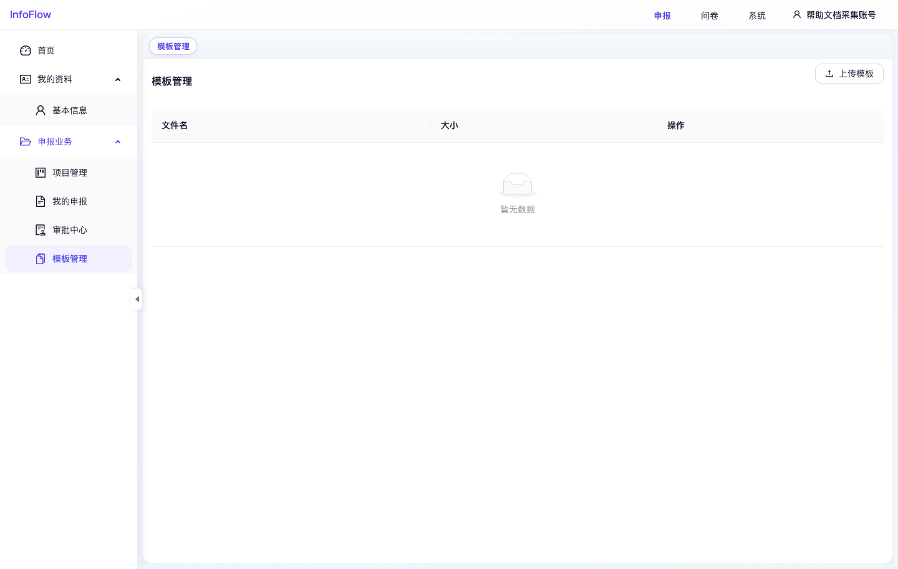

# 模板管理

入口路径：`/declaration/templates`

## 页面用途

模板管理用于维护申报材料相关的模板文件，便于用户下载或在业务中引用统一格式。

## 页面功能

- 点击“上传模板”添加模板文件。
- 列表展示文件名、大小和操作。
- 可对已上传模板执行页面提供的操作。

## 操作步骤

1. 进入“申报 / 申报业务 / 模板管理”。
2. 点击“上传模板”。
3. 选择本地模板文件并上传。
4. 上传成功后，在列表中查看文件名和大小。

## 注意事项

- 截图采集时模板列表暂无数据。
- 上传前建议确认模板命名规则和适用项目，避免用户下载错版本。

## 页面截图

