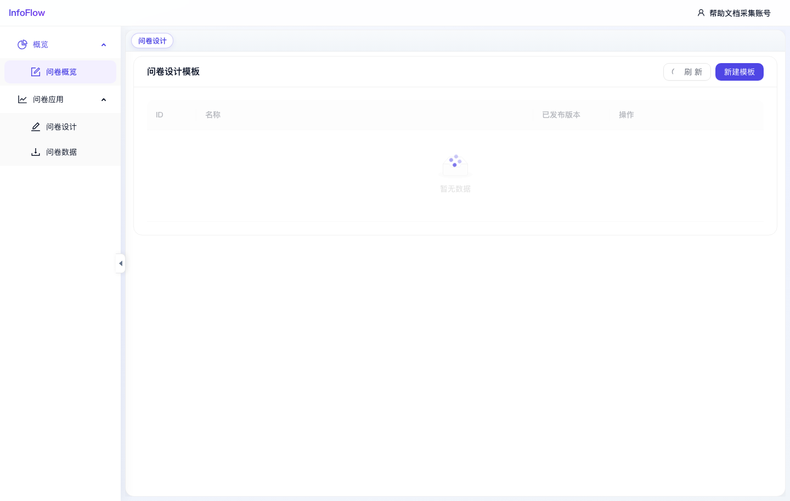

# 问卷设计

入口路径：`/survey/design`

## 页面用途

问卷设计用于创建和维护问卷模板，并管理模板的发布版本。

## 页面功能

- 点击“刷新”重新加载模板列表。
- 点击“新建模板”创建新的问卷模板。
- 列表展示 ID、名称、已发布版本和操作。

## 操作步骤

1. 进入“问卷 / 问卷应用 / 问卷设计”。
2. 点击“新建模板”创建问卷。
3. 在设计页面配置题目、选项和结构。
4. 保存草稿后，根据需要发布版本。
5. 返回列表查看已发布版本。

## 注意事项

- 截图采集时列表暂无数据。
- 问卷发布后，才能用于收集数据或在问卷数据页面查看提交记录。

## 页面截图

