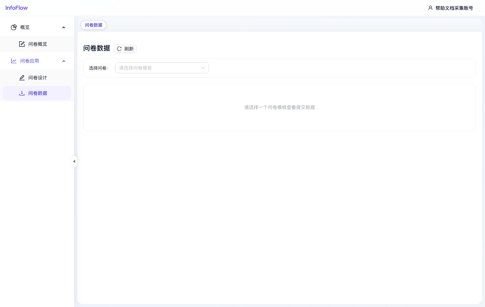

# 问卷数据

入口路径：`/survey/export`

## 页面用途

问卷数据用于按问卷模板查看提交数据，并进行后续导出或分析。

## 页面功能

- 点击“刷新”更新问卷数据。
- 通过“选择问卷”下拉框选择问卷模板。
- 选择模板后，页面展示该问卷的提交数据。

## 操作步骤

1. 进入“问卷 / 问卷应用 / 问卷数据”。
2. 在“选择问卷”下拉框中选择一个问卷模板。
3. 查看该问卷模板的提交数据。
4. 如页面提供导出操作，可按需导出数据。

## 注意事项

- 截图采集时尚未选择问卷，页面提示“请选择一个问卷模板查看提交数据”。

## 页面截图

