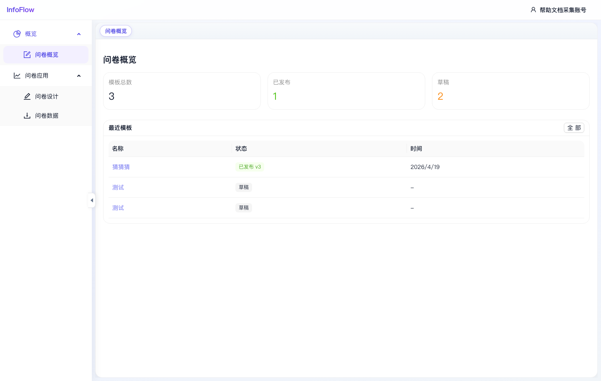

# 问卷概览

入口路径：`/survey`

## 页面用途

问卷概览用于查看问卷模块的整体情况，包括模板总数、已发布数量、草稿数量和最近模板。

## 页面信息

- 统计卡片：模板总数、已发布、草稿。
- “最近模板”列表展示问卷名称、状态和时间。
- “全部”入口用于查看更完整的模板列表。

## 操作步骤

1. 点击顶部“问卷”进入问卷模块。
2. 查看概览统计了解当前问卷模板状态。
3. 在最近模板中查看近期维护的问卷。
4. 需要创建或编辑问卷时，进入“问卷设计”。

## 注意事项

- 截图中模板总数为 3，已发布 1，草稿 2；实际数值取决于当前数据库。

## 页面截图

