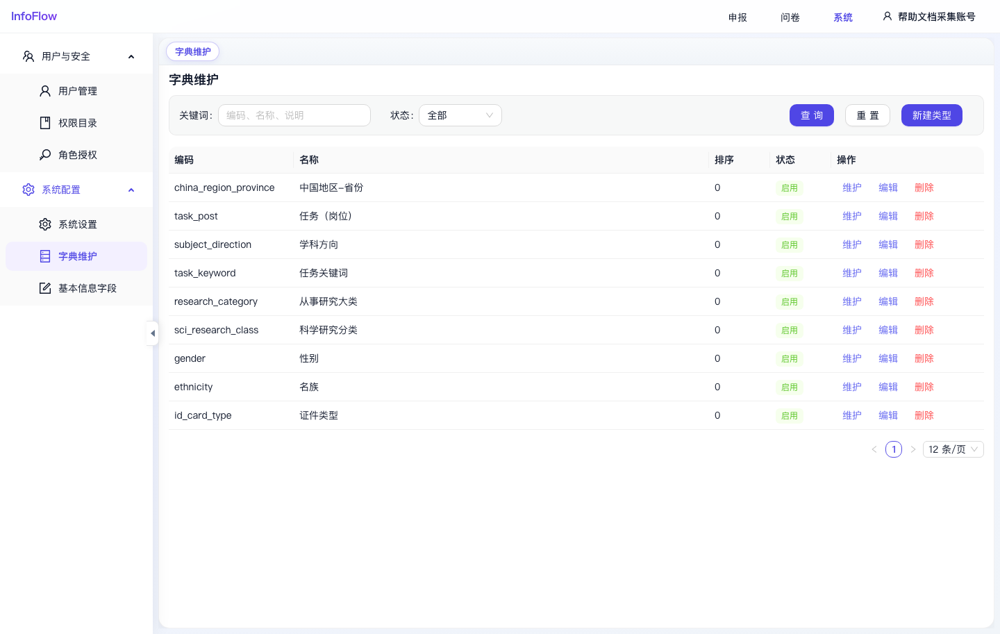

# 字典维护

入口路径：`/system/dict`

## 页面用途

字典维护用于管理系统中的基础枚举和下拉选项，例如地区、省份、岗位、学科方向、证件类型等。

## 页面功能

- 按关键词筛选字典类型。
- 按状态筛选，默认可选“全部”。
- 点击“查询”执行筛选。
- 点击“重置”清空筛选条件。
- 点击“新建类型”创建新的字典类型。
- 列表展示编码、名称、排序、状态和操作。

## 常用操作

1. 新建类型：点击“新建类型”，填写编码、名称、排序和状态。
2. 维护字典项：点击目标字典类型的“维护”，进入该类型的字典项页面。
3. 编辑类型：点击“编辑”修改名称、排序或状态。
4. 删除类型：点击“删除”移除不再使用的字典类型。

## 注意事项

- 字典编码通常会被表单字段或业务逻辑引用，创建后不建议随意变更。
- 截图中可见字典类型包括“中国地区-省份”“任务（岗位）”“学科方向”“性别”“民族”“证件类型”等。

## 页面截图

