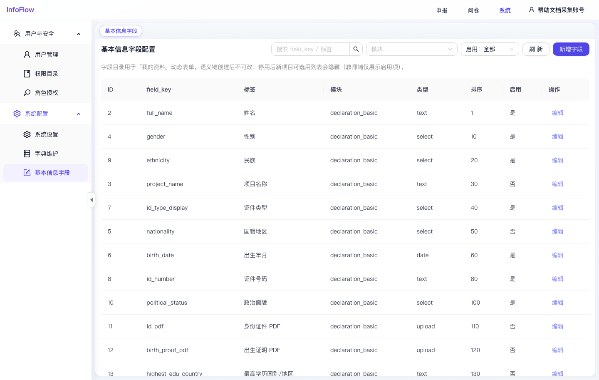

# 基本信息字段

入口路径：`/system/profile-fields`

## 页面用途

基本信息字段用于配置“我的资料”动态表单的字段目录。项目配置申报表时，可从这些字段中选择需要展示或采集的基础信息。

## 页面功能

- 按模块筛选字段。
- 按启用状态筛选字段，默认显示“全部”。
- 点击“刷新”重新加载字段目录。
- 点击“新增字段”添加字段。
- 列表展示 ID、field_key、标签、模块、类型、排序、启用状态和操作。

## 字段规则

- `field_key` 是字段语义键，创建后不可改。
- 停用字段后，新项目可选用列表会隐藏该字段。
- 教师端通常仅展示启用字段。
- 字段类型包括 text、select、date、upload 等。

## 常用操作

1. 新增字段：点击“新增字段”，填写语义键、标签、模块、类型和排序。
2. 编辑字段：点击目标字段的“编辑”，调整标签、排序或启用状态。
3. 控制展示：通过“启用”状态决定该字段是否参与后续表单配置和教师端展示。
4. 配合字典：select 类型字段通常需要与“字典维护”中的字典项配合使用。

## 注意事项

- 截图中 `full_name`、`gender`、`birth_date` 等字段处于启用状态。
- 配置变更会影响“我的资料”和项目申报表字段选择，应在业务低峰或确认影响范围后操作。

## 页面截图

