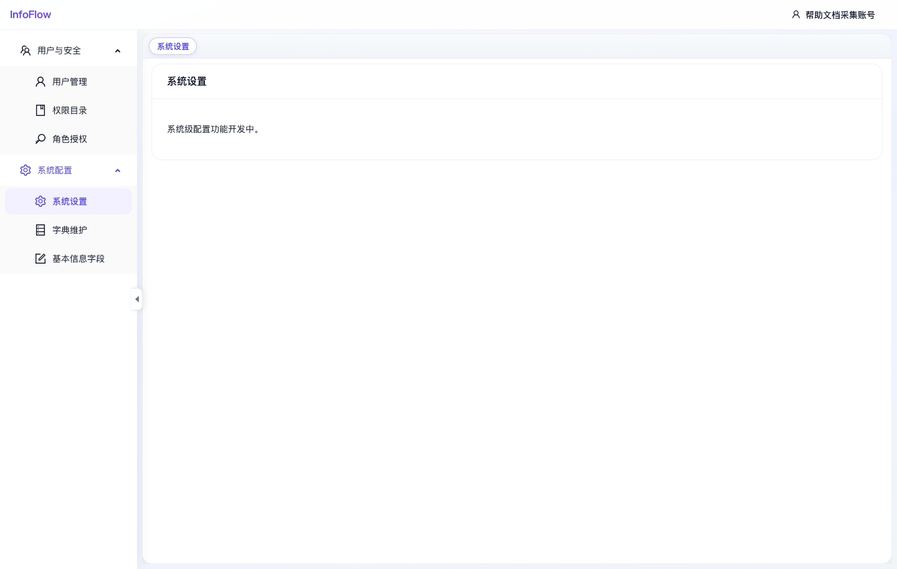

# 系统设置

入口路径：`/system/settings`

## 页面用途

系统设置用于承载全局系统配置。

## 当前状态

页面提示“系统级配置功能开发中。”，说明该功能入口已预留，但具体配置项尚未开放。

## 操作说明

1. 进入“系统 / 系统配置 / 系统设置”。
2. 查看当前系统级配置入口状态。
3. 等待后续版本补充具体配置项后再进行维护。

## 注意事项

- 当前页面不建议编写具体业务操作流程，以免与后续实现不一致。

## 页面截图

