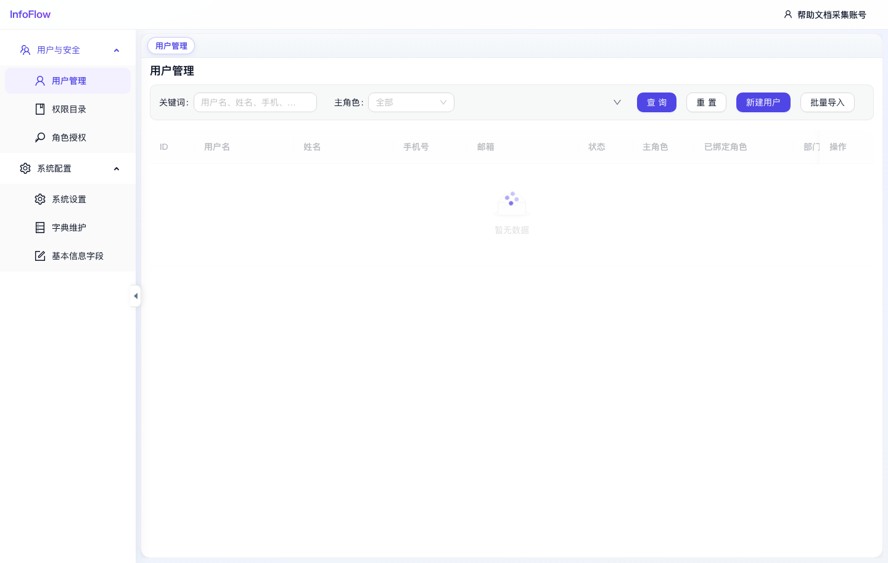

# 用户管理

入口路径：`/system/users`

## 页面用途

用户管理用于维护系统账号、账号状态、主角色和绑定角色。

## 页面功能

- 按关键词筛选用户。
- 按主角色筛选用户。
- 点击“查询”执行筛选。
- 点击“重置”清空筛选条件。
- 点击“新建用户”创建单个账号。
- 点击“批量导入”批量创建或更新账号。
- 列表展示 ID、用户名、姓名、手机号、邮箱、状态、主角色、已绑定角色、部门 ID 和操作。

## 操作步骤

1. 进入“系统 / 用户与安全 / 用户管理”。
2. 使用关键词或主角色筛选用户。
3. 点击“新建用户”录入账号信息。
4. 根据需要设置账号状态、主角色和绑定角色。
5. 保存后，用户即可按被授予的权限访问系统。

## 注意事项

- 截图采集时当前筛选结果暂无数据。
- 角色授权关系会影响用户可见菜单和可访问接口。

## 页面截图

